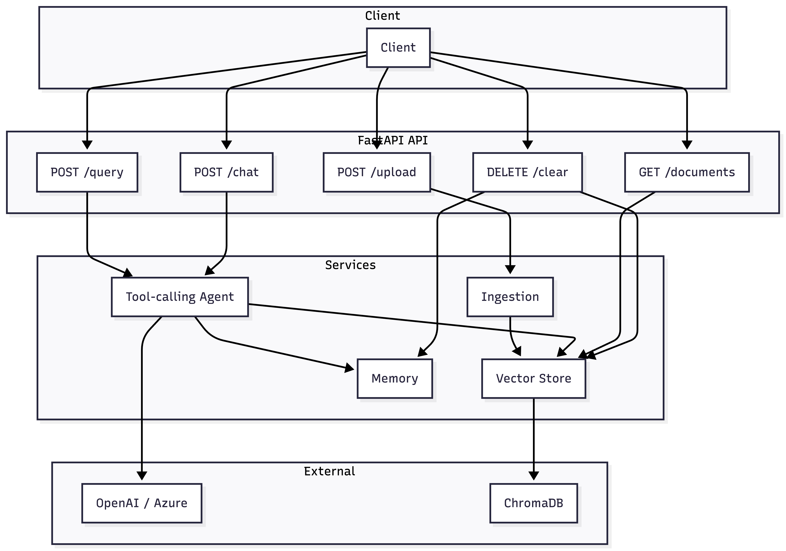
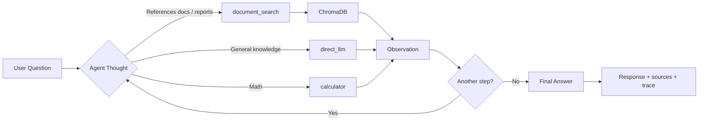

# GenAI Agentic RAG System

---

## Executive Summary

This system is a **production-oriented Agentic RAG API** that lets users upload documents (PDF, DOCX, TXT) and ask natural-language questions. An **agentic workflow** is at the centre: a tool-calling agent decides at runtime whether to **retrieve** from the vector store, answer from **internal knowledge**, use a **calculator**, or **combine** strategies. The agent exposes this via a **reasoning trace** and **source attribution** so answers are auditable. The stack is **modular** and **provider-agnostic**: a single **LLM abstraction layer** supports **Azure OpenAI (default)**, OpenAI, and Ollama for both chat and embeddings; switching provider requires only changing `LLM_PROVIDER` and the corresponding env vars.

---

## Architecture



**Components:**

- **FastAPI API** — REST endpoints; async handlers; request/response validation via Pydantic.
- **Ingestion** — Text extraction (pypdf, python-docx), semantic chunking, metadata (document, page, timestamp), embedding, and write to vector store.
- **Vector Store** — ChromaDB wrapper; persistent storage; similarity search with configurable top-k.
- **Tool-calling Agent** — LangChain agent with native tool calling; invokes document_search, direct_llm, calculator; produces answer, sources, and reasoning trace.
- **Memory** — In-memory conversation history keyed by `session_id` for multi-turn chat.
- **LLM / Embeddings** — Selected by `LLM_PROVIDER` (azure, openai, ollama); same interface for all; only `llm_factory` branches on provider.

---

## Agent Decision Flow



- **document_search** — Used when the user refers to uploaded documents, internal reports, or provided files. Queries ChromaDB and returns top-k chunks (default 3) with metadata.
- **direct_llm** — Used for general knowledge or when retrieval is unnecessary (e.g. “What is the capital of France?”).
- **calculator** — Used for arithmetic; single expression, sanitized input.
- The agent uses **native tool calling** (Azure OpenAI and OpenAI). Configure via `LLM_PROVIDER`; for Azure use **deployment names** (from Azure Portal), not model names.

---

## Design Decisions

| Area | Decision | Rationale |
|------|----------|-----------|
| **Agent pattern** | Tool-calling agent (LangChain `create_tool_calling_agent` + `AgentExecutor`) | OpenAI and Azure support structured tool calls; native tool calling gives reliable tool choice and arguments and avoids brittle prompt parsing. |
| **Vector store** | ChromaDB, persistent on disk | Simple to run locally, no separate server for dev; persistence survives restarts; good fit for single-node and containerised deployment. |
| **Architecture** | Modular services (ingestion, vector_store, agent, llm_factory, memory) | Clear separation of concerns; each layer testable and swappable; agent and routes stay free of embedding/DB details. |
| **API** | Async FastAPI | Non-blocking I/O; sync agent runs in `asyncio.to_thread` so the event loop is not blocked; scales better under concurrency. |
| **LLM abstraction** | `llm_factory` + `LLM_PROVIDER` | One code path for agent and embeddings; switch providers via env vars; no branching in agent or ingestion logic. |

---

## Alignment with Evaluation Rubric

- **Agentic Workflow (30%)** — Tool-calling agent that (a) classifies queries as GENERAL / DOCUMENT / HYBRID, (b) decides between `document_search`, `direct_llm`, or a hybrid path, and (c) exposes a structured `reasoning_trace` for auditability.
- **RAG Pipeline (20%)** — Semantic chunking with configurable size/overlap, metadata-rich storage in ChromaDB (document name, page, timestamp), and configurable top-k retrieval.
- **API Design (20%)** — Async FastAPI endpoints with typed request/response models, clear validation and HTTP errors, and a clean separation between routes and services.
- **Code Quality (15%)** — Modular services (`ingestion`, `vector_store`, `agent`, `llm_factory`, `memory`), type hints, docstrings, and minimal duplication.
- **Bonus (15%)** — Multi-turn chat with session memory, Docker packaging, provider abstraction (OpenAI/Azure), basic observability (request IDs, timing, retrieval logs), and a heuristic confidence score.

---

## Response Format (Query / Chat)

Every `/api/query` and `/api/chat` response has this shape:

| Field | Meaning |
|-------|--------|
| **answer** | Final natural-language answer to the user. |
| **sources** | List of cited chunks when retrieval was used: `document`, `page`, `chunk` (snippet), `score`. Empty when the agent used only internal knowledge. |
| **reasoning_trace** | Step-by-step record of what the agent did: each step can include `thought`, `action`, `action_input`, `observation`, and optionally `conclusion`. Lets you see which tools were called and with what inputs/outputs. |
| **retrieval_used** | Boolean: `true` if the agent used `document_search` (including in HYBRID mode); `false` if it answered only via `direct_llm` or `calculator`. Use this as a coarse \"from your docs\" vs \"from model\" flag. |
| **confidence** | Heuristic confidence score in \[0, 1\], based on whether retrieval was used, whether sources were found, and the query type (GENERAL / DOCUMENT / HYBRID). Intended as a soft signal, not a calibrated probability. |

Example:

```json
{
  "answer": "The capital of France is Paris.",
  "sources": [],
  "reasoning_trace": [
    {"step": 1, "action": "direct_llm", "action_input": "What is the capital of France?", "observation": "Paris is the capital..."},
    {"step": 2, "conclusion": "The capital of France is Paris."}
  ],
  "retrieval_used": false,
  "confidence": 0.7
}
```

---

## Scalability Considerations

- **Persistent vector store** — ChromaDB data is stored on disk (`CHROMA_PERSIST_DIR`); survives restarts and can be backed by a volume in Docker.
- **Stateless API** — No server-side session storage for request identity; only the agent and in-memory chat history. Scale horizontally by adding instances; document corpus is shared via the same Chroma path or a future shared vector backend.
- **Provider abstraction** — Swapping OpenAI for Azure (or another provider behind the same interface) does not change API or agent code; only config and credentials.
- **Docker** — Single-image deployment; env-based config; volume for Chroma data. Suitable for single-node or small-cluster deployment.

---

## Limitations & Future Improvements

- **Session memory** — Stored in process memory; lost on restart and not shared across instances. **Improvement:** Redis- (or similar) backed session store for durability and multi-instance chat.
- **Retrieval** — Currently pure semantic search (embeddings + similarity). **Improvement:** Hybrid retrieval (e.g. BM25 + embeddings) for better keyword and long-tail queries.
- **Confidence** — Confidence score is a simple heuristic, not calibrated. **Improvement:** Use more principled confidence estimation (ensembles, self-consistency, or retrieval statistics) for production safety-critical use cases.
- **Streaming** — Responses are returned only when the full answer is ready. **Improvement:** SSE or similar streaming for answer and/or reasoning trace to improve perceived latency.

---

## Why This Is Agentic (Not Just RAG)

- The system does more than static retrieval + generation: it uses a **tool-calling agent** that can choose between `document_search`, `direct_llm`, and a HYBRID path per query.
- A dedicated **classification step** (GENERAL / DOCUMENT / HYBRID) steers the agent and hybrid logic, rather than always retrieving or never retrieving.
- The agent maintains a **reasoning trace** of tool invocations and observations, making its behaviour inspectable and debuggable.
- Tools are first-class LangChain tools with clear contracts, enabling extension (e.g. web_search, SQL, analytics) without changing API shape.\n+
---

## Security Considerations

- **API keys** — LLM credentials are injected via environment variables (`OPENAI_API_KEY`, `AZURE_OPENAI_API_KEY`) and never logged.
- **File handling** — Uploads are restricted to PDF/DOCX/TXT, with size limits and basic validation; no code execution or template rendering occurs on uploaded content.
- **Error handling** — Internal errors are logged but surfaced to clients only as generic HTTP errors; stack traces are not returned in responses.
- **Dependencies** — Uses well-known OSS components (FastAPI, LangChain, ChromaDB); all configuration is via `.env` and Docker env vars.\n+
---

## Failure Modes

- **Empty or missing documents** — `document_search` returns a clear \"No relevant documents found.\" observation; `retrieval_used` remains `false` and `sources` is empty.
- **Vector store issues** — Errors during similarity search are caught and logged; the agent returns a graceful error message instead of crashing.
- **LLM/API failures** — Exceptions from the LLM are caught and converted into user-facing error messages; HTTP 500 is returned from the API with a concise `detail`.
- **Misconfiguration** — Missing API keys or unsupported `LLM_PROVIDER` values are validated at LLM factory level with explicit error messages.\n+

---

## Prerequisites

- **Python 3.11+**
- **Azure OpenAI** credentials (default): endpoint, API key, and **deployment names** for chat and embeddings. Optionally use **OpenAI** or **Ollama** by setting `LLM_PROVIDER`.

---

## Quick Start (Local)

### Option A: With [uv](https://docs.astral.sh/uv/) (recommended)

```bash
cd /path/to/agent
# Install uv: curl -LsSf https://astral.sh/uv/install.sh | sh
uv sync
cp .env.example .env
# Edit .env: set Azure (or other provider) credentials
uv run uvicorn app.main:app --reload --host 0.0.0.0 --port 8000
```

Run tests: `uv run pytest tests/ -v`

### Option B: With pip + venv

```bash
cd /path/to/agent
python3 -m venv .venv
source .venv/bin/activate   # Windows: .venv\Scripts\activate
pip install -r requirements.txt
cp .env.example .env
# Edit .env: set AZURE_OPENAI_API_KEY, AZURE_OPENAI_ENDPOINT,
#            AZURE_OPENAI_DEPLOYMENT_NAME, AZURE_OPENAI_EMBEDDING_DEPLOYMENT
uvicorn app.main:app --reload --host 0.0.0.0 --port 8000
```

**Note:** Shell environment variables override values in `.env`. If you see Azure 401 or the wrong deployment, start the server from a clean shell or unset `AZURE_OPENAI_*` so the app uses your `.env` file.

- API: http://localhost:8000  
- Docs: http://localhost:8000/docs  

---

## Docker

```bash
docker build -t agentic-rag .

# Default: Azure OpenAI (set your Azure env vars)
docker run -p 8000:8000 \
  -e LLM_PROVIDER=azure \
  -e AZURE_OPENAI_API_KEY=your-key \
  -e AZURE_OPENAI_ENDPOINT=https://your-resource.openai.azure.com/ \
  -e AZURE_OPENAI_DEPLOYMENT_NAME=your-chat-deployment \
  -e AZURE_OPENAI_EMBEDDING_DEPLOYMENT=your-embedding-deployment \
  -v rag_data:/data \
  agentic-rag
```

To use **OpenAI** or **Ollama** instead, set `LLM_PROVIDER=openai` or `LLM_PROVIDER=ollama` and the corresponding env vars. No code changes required.

---

## Provider Configuration

| Provider | `.env` | Required (deployment = Azure deployment name, not model name) |
|----------|--------|---------------------------------------------------------------|
| **Azure** (default) | `LLM_PROVIDER=azure` | `AZURE_OPENAI_API_KEY`, `AZURE_OPENAI_ENDPOINT`, `AZURE_OPENAI_API_VERSION`, `AZURE_OPENAI_DEPLOYMENT_NAME`, `AZURE_OPENAI_EMBEDDING_DEPLOYMENT` |
| **OpenAI** | `LLM_PROVIDER=openai` | `OPENAI_API_KEY` |
| **Ollama** | `LLM_PROVIDER=ollama` | Optional: `OLLAMA_BASE_URL`, `OLLAMA_MODEL`, `OLLAMA_EMBEDDING_MODEL` |

Restart the app after changing `LLM_PROVIDER`. Embeddings use the same provider. For Azure, configure **deployment names** (as in Azure Portal), not model names.

---

## API Overview

| Method | Endpoint | Description |
|--------|----------|-------------|
| POST | `/api/upload` | Upload PDF/DOCX/TXT → chunk, embed, store in ChromaDB |
| POST | `/api/query` | Single question → answer, sources, reasoning trace, retrieval_used |
| POST | `/api/chat` | Multi-turn chat with `session_id` |
| GET | `/api/documents` | List uploaded documents and metadata |
| DELETE | `/api/clear` | Clear vector store and all session memory |

---

## cURL Examples

**Health**

```bash
curl -s http://localhost:8000/health
```

**Upload**

```bash
curl -X POST http://localhost:8000/api/upload -F "file=@/path/to/report.pdf"
```

**Query (agent may use retrieval or direct LLM)**

```bash
curl -X POST http://localhost:8000/api/query \
  -H "Content-Type: application/json" \
  -d '{"question": "What did our Q3 report say about revenue?"}'
```

**Query (general knowledge; typically no retrieval)**

```bash
curl -X POST http://localhost:8000/api/query \
  -H "Content-Type: application/json" \
  -d '{"question": "What is the capital of France?"}'
```

**Chat (multi-turn)**

```bash
curl -X POST http://localhost:8000/api/chat \
  -H "Content-Type: application/json" \
  -d '{"session_id": "user-123", "message": "Summarize the main points from the documents I uploaded."}'
```

**List documents**

```bash
curl -s http://localhost:8000/api/documents
```

**Clear all data**

```bash
curl -X DELETE http://localhost:8000/api/clear
```

---

## Testing

- **With uv:** `uv run pytest tests/ -v`
- **With pip:** `pytest tests/ -v` (requires Azure configured for full suite). See `tests/README.md`.
- **Curl script:** `./scripts/curl_tests.sh [BASE_URL]` for manual endpoint checks.
- **Manual QA:** `tests/MANUAL_QA_CHECKLIST.md` and `tests/EXPECTED_OUTPUTS.md`.

---

## Project Structure

```
app/
  main.py              # FastAPI app, CORS, health
  api/routes.py        # Upload, query, chat, documents, clear
  services/
    ingestion.py       # PDF/DOCX/TXT → chunk → embed → store
    vector_store.py    # ChromaDB wrapper
    agent.py           # Tool-calling agent (document_search, direct_llm, calculator)
    llm_factory.py     # LLM and embeddings by LLM_PROVIDER
    memory.py          # In-memory chat sessions
  models/schemas.py    # Pydantic request/response models
  core/config.py       # Settings from env
  utils/chunking.py    # Semantic chunking
```

---

## License

MIT.
